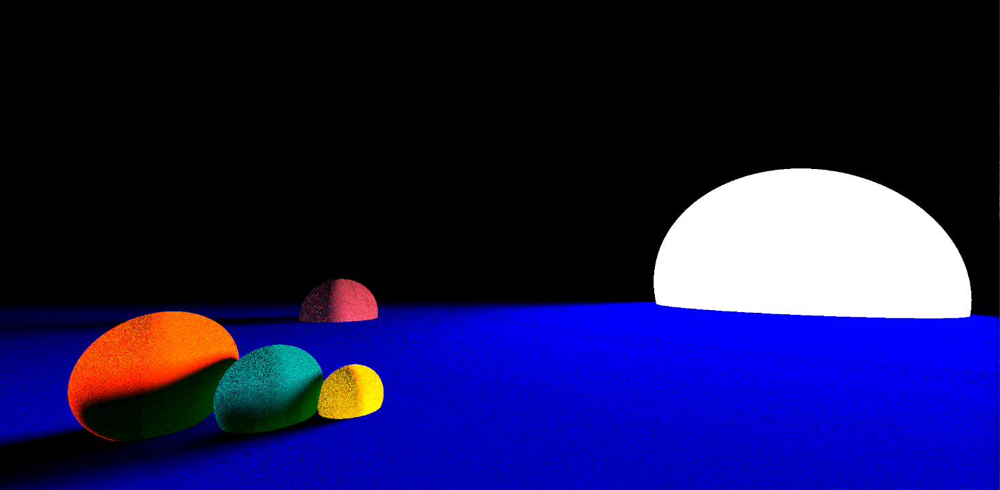

# RayTrace_Unity

Follow me in my journey to create an average at best ray-tracing shader in HLSL, using the Unity engine.

The current goals for this project are as follows:

1. Draw to the screen - DONE
2. Draw spheres to the screen - DONE
3. Develop method for casting rays from the camera - DONE
4. Calculating and interpretting ray collisions with spheres - DONE
5. Adding ray bouncing - DONE
6. Multiple rays per pixel - DONE
7. Colour ray tracing across bounces - DONE
8. Easier way of creating scenes (render in scene cam, use actual unity sphere meshes as placeholders in the editor?) - DONE
9. Anti-Aliasing
10. Primitive ray colisions
11. Mesh ray collisions
12. Depth of field / lens effects

